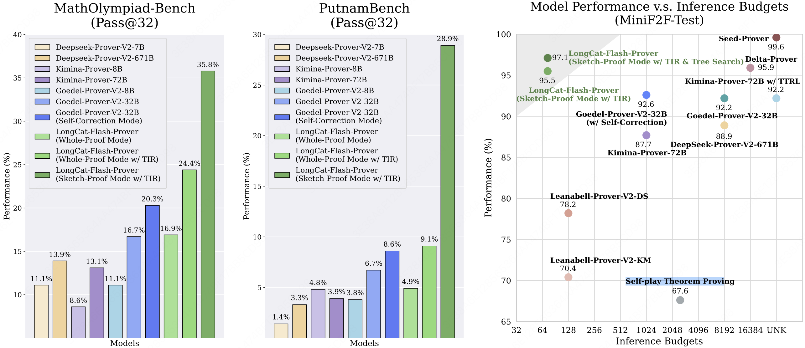
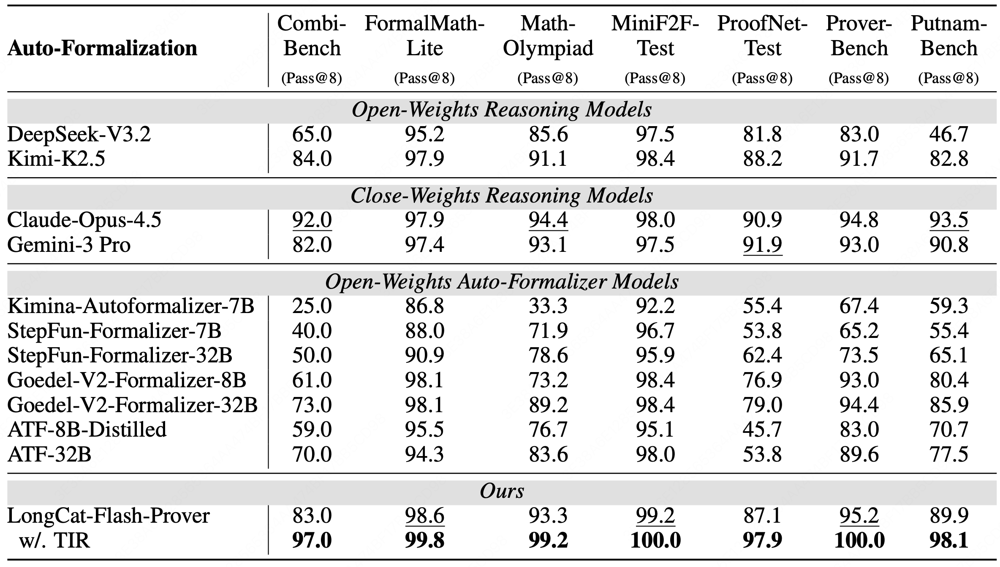
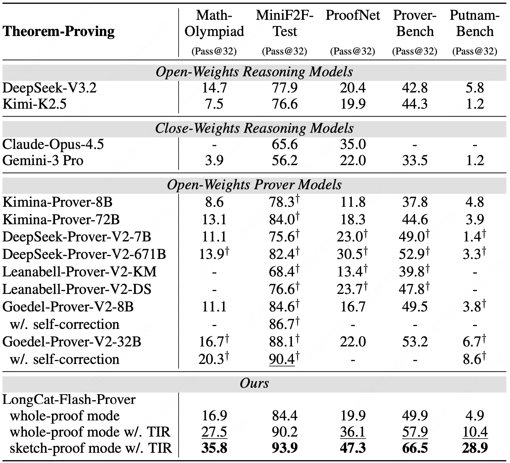
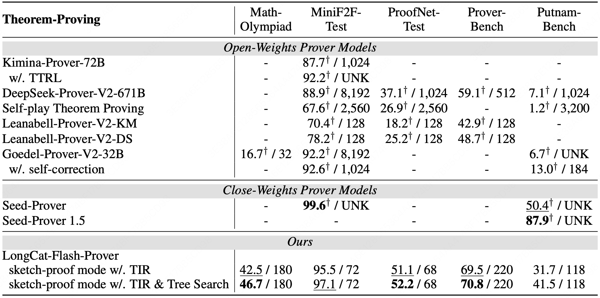
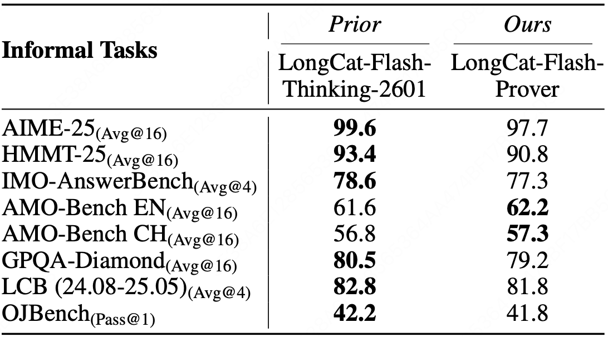

# LongCat-Flash-Prover

<div align="center">
  
</div>
<hr>


<div align="center" style="line-height: 1;">
  <a href="https://longcat.ai/" target="_blank" style="margin: 2px;">
    
  </a>
  <a href="https://huggingface.co/meituan-longcat" target="_blank" style="margin: 2px;">
    
  </a>
  <a href="https://www.modelscope.cn/models/meituan-longcat/LongCat-Flash-Prover" target="_blank" style="margin: 2px;">
    
  </a>
</div>

<div align="center" style="line-height: 1;">
  <a href="https://github.com/meituan-longcat/LongCat-Flash-Prover/blob/main/figures/wechat_official_accounts.png" target="_blank" style="margin: 2px;">
    
  </a>
  <a href="https://discord.gg/EXsG52D8SW">
    
  </a>
  <a href="https://x.com/Meituan_LongCat" target="_blank" style="margin: 2px;">
    
  </a>
</div>

<div align="center" style="line-height: 1;">
  <a href="https://huggingface.co/meituan-longcat/LongCat-Flash-Prover/blob/main/LICENSE" style="margin: 2px;">
    
  </a>
</div>
<p align="center">
  <a href="https://github.com/meituan-longcat/LongCat-Flash-Prover/blob/main/LongCat_Flash_Prover_Technical_Report.pdf"><b>Tech Report</b>&nbsp;📄</a>
</p>


<hr>
<div align="center" style="line-height: 1;">
  
</div>

## Introduction

We introduce **LongCat-Flash-Prover**, a flagship $560$-billion-parameter open-source Mixture-of-Experts (MoE) model that advances Native Formal Reasoning in Lean4 through agentic tool-integrated reasoning (TIR).
We decompose the native formal reasoning task into three independent formal capabilities, i.e., auto-formalization, sketching, and proving. 
To facilitate these capabilities, we propose a Hybrid-Experts Iteration Framework to expand high-quality task trajectories, including generating a formal statement based on a given informal problem, producing a whole-proof directly from the statement, or a lemma-style sketch.
During agentic RL, we present a Hierarchical Importance Sampling Policy Optimization (HisPO) algorithm, which aims to stabilize the MoE model training on such long-horizon tasks. It employs a gradient masking strategy that accounts for the policy staleness and the inherent train-inference engine discrepancies at both sequence and token levels.
Additionally, we also incorporate theorem consistency and legality detection mechanisms to eliminate reward hacking issues.

Extensive evaluations show that our LongCat-Flash-Prover sets a new state-of-the-art for open-weights models in both auto-formalization and theorem proving. Demonstrating remarkable sample efficiency, it achieves a 97.1\% pass rate on MiniF2F-Test using only 72 inferences per problem. On more challenging benchmarks, it solves 70.8\% of ProverBench and 41.5\% of PutnamBench with no more than 220 attempts per problem, significantly outperforming existing open-weights baselines.


## Key Features

### 🌟 Native formal reasoning

We define **native formal reasoning** as a core capability of LLMs, analogous to native multimodal and native tool calls. This paradigm enables the model to leverage formal operators to solve complex reasoning tasks without specialized architectural modifications.
We decompose the native formal reasoning into three specific capabilities: 1) **Agentic auto-formalization** aims to transform the informal statement into a verified formal statement; 2) **Agentic sketching** aims to generate a lemma-style sketch based upon the given problem and corresponding formal statement; 3) **Agentic proving** aims to generate a whole-proof that completes the target theorem body, or to generate a lemma-style proof that introduces helper lemmas and finally proves the target theorem. These capabilities are further enhanced through a TIR strategy, where all experts can interact directly with the Lean4 tools for compilation and verification.


### 🌟 Hybrid-experts iteration framework

To facilitate native formal reasoning, we developed a framework to generate high-quality cold-start data. This framework employs several optimized expert models,  each specialized in distinct domains such as auto-formalization, lemma-style sketching, and proving. 
We utilize this framework to synthesize a series of trajectories centered on native formal operators, using multiple verifiable formal tools as environmental feedback.
By doing so, each expert is iteratively refined on these tool-assisted reasoning trajectories, emulating the human process of learning through trial, verification, and reflection.


### 🌟 Hierarchical Importance Sampling Policy Optimization (HisPO).
Following our prior works, we perform agentic reinforcement learning with verified reward (RLVR) by designing different tasks, including generating a formal statement based on a given informal problem, producing a proof directly from the statement, or a lemma-style sketch. 
To make the MoE model training stable, we introduce HisPO, which is a hierarchical clipping strategy that eliminates the gradient contributions who has large training-inference engine discrepancy by estimating sequence-wise or token-wise important sampling (IS) ratios. 
In addition to outcome-based rewards, we designed a legality detection strategy to explore the proof with obvious hacking features, for example, the proof that is inconsistent with the semantics of the formal statement, mismatching the pre-defined theorem conditions, containing unverified or model-created axioms that attempt to fool the Lean4 server, etc.

## Evaluation Results

### Auto-Formalization
Auto-formalization performance (Pass@8 metric, %) of different reasoning and specific auto-formalizer models
across multiple benchmarks. Best in bold, second best in underlined.

<div align="center" style="line-height: 1;">
  
</div>

### Theorem Proving
Theorem-proving performance (Pass@32 metric, %) of different reasoning and specific prover models across
multiple benchmarks. Best in bold, second best in underlined. † indicates the score is from external reports.

<div align="center" style="line-height: 1;">
  
</div>

Theorem-proving performance (with different larger budgets, %) of different specific prover models across multiple benchmarks. Best in bold, second best in underlined. Each element a / b denotes to the accuracy a with limited budget b (i.e., Pass@b). “UNK” means unknown of the specific budget. † indicates the score is from external reports. Because different models may have different budget calculations, we directly extract the results from the report instead of conducting our own evaluations. Therefore, some benchmark results may not be available.

<div align="center" style="line-height: 1;">
  
</div>

### General Reasoning

Performance (%) comparison across multiple general reasoning benchmarks. Best in bold. The result indicates that our LongCat-Flash-Prover can retain the general reasoning ability.

<div align="center" style="line-height: 1;">
  
</div>


## Quick Start

### Chat Template Overview

To support advanced tool-use scenarios and sophisticated reasoning paradigms, we have introduced significant updates to our chat template, as defined in the `tokenizer_config.json` file. 

#### Basic Usage
The chat template can be applied using the ```apply_chat_template``` method. Below is a standard implementation:

```python
text = tokenizer.apply_chat_template(
    messages,
    tools=tools,
    tokenize=False,
    enable_thinking=True,
    add_generation_prompt=True,
    save_history_reasoning_content=False
)
```

#### Key Features
*   **Tool Declaration:** Available tools are declared at the beginning of the session to activate the model's tool-use capabilities and define the scope of available actions.
*   **Interleaved Thinking:** By default, the template employs an interleaved thinking approach. In this mode, the final response is preserved while thinking content from previous user interactions is discarded to maintain a concise context window. Tool calls and responses are retained to provide necessary execution history.
*   **Reasoning Retention:** If you need to preserve the model's thinking content across turns, you can enable this by setting `save_history_reasoning_content=True`.

#### Implementation Examples

##### 1. Multi-Turn Dialogue
This example demonstrates how the template handles conversational history and thinking content.

```python
from transformers import AutoModelForCausalLM, AutoTokenizer

model_name = "meituan-longcat/LongCat-Flash-Prover"

# Load the tokenizer and the model
tokenizer = AutoTokenizer.from_pretrained(model_name)

messages = [
    {"role": "user", "content": "Let T0 = 2, T1 = 3, T2 = 6, and for n ≥ 3, Tn = (n+4)Tn−1 −4nTn−2 +(4n−8)Tn−3. The first few terms are 2, 3, 6, 14, 40, 152, 784, 5168, 40576. Find, with proof, a formula for Tn of the form Tn = An +Bn, where {An} and {Bn} are well-known sequences."},
    {"role": "assistant", "reasoning_content": "...", "content": "..."}
]

text = tokenizer.apply_chat_template(
    messages,
    tokenize=False,
    enable_thinking=True,
    add_generation_prompt=True,
    save_history_reasoning_content=False # Discard reasoning history to save tokens
)

model_inputs = tokenizer([text], return_tensors="pt").to(model.device)

# Generate response
generated_ids = model.generate(
    **model_inputs,
    max_new_tokens=32768
)
output_ids = generated_ids[0][len(model_inputs.input_ids[0]):].tolist() 
```

##### 2. Tool Calling
This example illustrates how to integrate function calling within the reasoning framework.


```python
tools = [
    {
        "type": "function",
        "function": {
            "name": "syntax_check",
            "description": "Check the syntactic correctness of the formal statement in Lean4.",
            "parameters": {
                "type": "object",
                "properties": {
                    "formal_statement": {
                        "type": "string", 
                        "description": "Theorem statement in Lean4 code without ```lean4."
                    }
                },
                "required": ["formal_statement"]
            }
        }
    },
    {
        "type": "function",
        "function": {
            "name": "consistency_check",
            "description": "Check the semantic consistency between the Lean4 statement and the original natural language statement.",
            "parameters": {
                "type": "object",
                "properties": {
                    "informal_statement": {
                        "type": "string", 
                        "description": "Natural language statement."
                    },
                    "formal_statement": {
                        "type": "string", 
                        "description": "Theorem statement in Lean4 code without ```lean4."
                    }
                },
                "required": ["informal_statement", "formal_statement"]
            }
        }
    }
]

messages = [
    {"role": "user", "content": "Think about and formalize the following problem in Lean 4.\n# Problem: The father has six sons and ten identical, indistinguishable balls. How many ways can he give the balls to his sons if everyone gets at least one? Prove that the answer is 126."},
    {
        "role": "assistant", 
        "reasoning_content": "...", 
        "tool_calls": [{"type": "function", "function": {"name": "syntax_check", "arguments": {"formal_statement": "```lean4\n...\n```"}}}]
    },
    {"role": "tool", "name": "syntax_check", "content": "..."}
]

text = tokenizer.apply_chat_template(
    messages,
    tools=tools,
    tokenize=False,
    enable_thinking=True,
    add_generation_prompt=True,
    save_history_reasoning_content=False
)

model_inputs = tokenizer([text], return_tensors="pt").to(model.device)

# Generate response based on tool result
generated_ids = model.generate(
    **model_inputs,
    max_new_tokens=32768
)
output_ids = generated_ids[0][len(model_inputs.input_ids[0]):].tolist() 

print(tokenizer.decode(output_ids, skip_special_tokens=True).strip("\n"))
```

## Deployment

We have implemented basic adaptations in both SGLang and vLLM to support the deployment of LongCat-Flash-Prover. Please refer to the [Deployment Guide](docs/deployment_guide.md) for detailed deployment instructions.


## License Agreement

The **model weights** are released under the **MIT License**. 

Any contributions to this repository are licensed under the MIT License, unless otherwise stated. This license does not grant any rights to use Meituan trademarks or patents. 

See the [LICENSE](LICENSE) file for the full license text.

## Usage Considerations 


This proprietary model has been custom-optimized for mathematical and formal theorem proofs. 
This model has not been specifically designed or comprehensively evaluated for every possible downstream application. 
It is not recommended for use as a regular conversational AI.

## Contact
Please contact us at <a href="mailto:longcat-team@meituan.com">longcat-team@meituan.com</a> or join our WeChat Group if you have any questions.

#### WeChat Group


